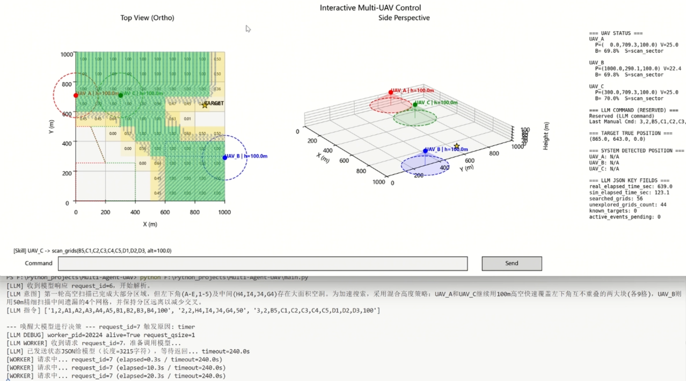

# Multi-Agent-UAV 项目简介

`Multi-Agent-UAV` 是一个基于大模型的多无人机协同任务的 3D 仿真与决策平台。项目采用**大小脑分层架构**：
- **大脑层**：基于大型语言模型（LLM）的高阶任务规划与决策引擎，支持多智能体协作策略生成
- **小脑层**：底层飞行控制器、物理/资源模型与原子技能库，确保指令精确执行
- **感知-决策-执行闭环**：实时传感器反馈驱动动态重规划，支持多 UAV 协同与冲突处理

核心特性包括：三机实时 3D 可视化（双视角透视）、图形界面任务下发、电量/传感器噪声仿真、LLM 驱动的自主决策，以及可扩展的原子技能框架。

当前版本以 `main.py` 为唯一主入口，包含：

- 多 UAV 状态机与基础飞行技能（位于 `sim/`）
- 双视角 3D 渲染与交互控制（位于 `viz/renderer.py`）
- 可选的 LLM 控制器（位于 `llm_controller.py`，由 `llm_config.json` 驱动）

## 快速使用

### 1) 安装依赖（导入包）

在项目根目录执行：

```powershell
pip install -r requirements.txt
```

### 2) 配置你自己的 API Key

先复制环境模板：

```powershell
Copy-Item .\llm.env.example .\llm.env
```

然后打开 `llm.env`，填写你自己的密钥：

```dotenv
SILICONFLOW_API_KEY=你的_siliconflow_key
DEEPSEEK_API_KEY=你的_deepseek_key
DMX_API_KEY=你的_dmx_key
```

> 注意：`llm.env` 已在 `.gitignore` 中，默认不会上传到仓库。

### 3) 运行项目

```powershell
python main.py
```

### 4) 运行效果图




## 目录结构

```text
Multi-Agent-UAV/
├─ main.py
├─ llm_controller.py
├─ llm_config.json
├─ llm.env
├─ UAV_SKILLS.md
├─ README.md
├─ sim/
│  ├─ __init__.py
│  ├─ environment.py
│  ├─ global_state_manager.py
│  └─ uav.py
└─ viz/
   ├─ __init__.py
   └─ renderer.py
```

## 各文件作用

- `main.py`：程序入口，初始化 UAV、全局状态、LLM 控制器与可视化渲染器。
- `llm_controller.py`：LLM 决策控制与异步 worker 逻辑。
- `llm_config.json`：LLM 配置（模型、base_url、触发策略等）。
- `llm.env`：本地 API Key 环境变量文件（例如 `DEEPSEEK_API_KEY=...`）。
- `UAV_SKILLS.md`：系统提示词（技能规范）。
- `sim/`：仿真核心（环境、UAV 状态机、全局状态管理）。
- `viz/renderer.py`：3D 可视化与交互控制界面。

## 文件说明

- `main.py` 会使用 `llm_config.json` 与 `UAV_SKILLS.md` 初始化 LLM 控制器。
- 若 `llm_config.json` 中 `enabled=true`，请确保 `llm.env` 中配置了对应 API Key。
- 运行过程中可能会在根目录生成 `llm_state_stream.jsonl`、`llm_worker.log` 等运行产物（属于正常输出）。
 
## UAV 小脑模型说明

核心类：`sim/uav.py` 中的 `UAV`

### 1) 资源与物理属性

- `battery: float = 100.0`
  - 初始电量 100%
- `has_payload: bool = False`
  - 是否已挂载目标（挂载后耗电更高）
- `max_speed: float = 25.0` (m/s)
- `max_accel: float = 6.0` (m/s^2)
- `current_skill: str`
  - 当前技能状态
- `waypoints: list[np.ndarray]`
  - 当前技能对应的航点队列

### 2) 电量模型（按帧扣减）

- 悬停：`0.05% / frame`
- 平飞/爬升：`0.1% / frame`
- 挂载目标后：`0.3% / frame`（优先）

实现位置：`_consume_battery()`

### 3) 视觉与高度博弈模型

- 视场覆盖半径：`R_fov = H * 1.5`
- 坐标噪声尺度：`Noise = H * 0.2`

实现位置：

- `fov_radius` 属性
- `sensor_noise` 属性

---

## Atomic Skills（底层原子技能）

以下技能都封装在 `UAV` 类内部：

- `skill_loiter()`
  - 紧急悬停，速度归零，保持当前位置

- `skill_goto(target_pos)`
  - 直线飞向目标点
  - 使用简单 P 控制 + 速度/加速度限制
  - 由 `update_state()` 每帧推进

- `skill_scan_sector(x_min, x_max, y_min, y_max, altitude)`
  - 先爬升到指定高度
  - 自动生成弓字形（Lawnmower）航点覆盖搜索区域
  - 每帧按航点队列推进

- `skill_descend_verify(approx_pos, verify_altitude)`
  - 先飞到模糊坐标上方，再下降到验证高度进行抵近确认

- `skill_grasp_payload(exact_pos)`
  - 飞到精确坐标，上方对齐后下降至地面（`Z=0`）
  - 将 `has_payload = True`
  - 随后自动触发返航

- `skill_return_base(cruise_altitude)`
  - 先爬升至安全巡航高度
  - 再飞回基点（默认 `home_pos = (0,0,0)`）

---

## 主执行循环（状态机）

方法：`UAV.update_state(dt)`

每帧核心流程：

1. 电量检查（为 0 时强制悬停）
2. 根据 `current_skill` 与 `waypoints` 执行一步运动
3. 技能收尾逻辑（如 `grasp_payload` 完成后自动返航）
4. 位置约束与电量扣减
5. 目标检测（若目标在 FOV 投影范围内，打印带噪声坐标）

---

## 目标检测逻辑

固定目标：

- `TARGET = (612, 498, 0)`（见 `sim/uav.py`）

检测规则：

- 若目标 XY 距离小于当前 `fov_radius`，则判定“发现目标”
- 控制台输出：
  - UAV ID
  - 当前高度
  - 带噪声目标坐标（噪声与高度正相关）

---

## 交互操作说明（当前已接入）

渲染入口：`SceneRenderer3D.render_interactive_control(...)`

可在 UI 底部输入框输入**数字编码命令**（逗号分隔）：

- `1,1,500,500,50`
- `2,2,560,680,440,560,40`
- `3,5,35`

### 统一命令格式

`uav_id,skill_id,param1,param2,...`

- `uav_id`: `1/2/3`（分别对应 `UAV_A/UAV_B/UAV_C`）
- `skill_id`: 技能编号，见下表

### Skill 编号与参数

- `0` -> `skill_loiter`  
  格式：`uav,0`

- `1` -> `skill_goto`  
  格式：`uav,1,x,y,z`

- `2` -> `skill_scan_sector`  
  格式：`uav,2,center_x,center_y,search_radius,altitude`

- `3` -> `skill_descend_verify`  
  格式：`uav,3,approx_x,approx_y,approx_z,verify_altitude`

- `4` -> `skill_grasp_payload`  
  格式：`uav,4,exact_x,exact_y,exact_z`

- `5` -> `skill_return_base`  
  格式：`uav,5,cruise_altitude`

### 示例

- `1,0` -> 1号机悬停
- `1,1,500,500,50` -> 1号机飞到 `(500,500,50)`
- `2,2,620,500,100,40` -> 2号机在指定区域执行扫描
- `3,3,610,495,0,15` -> 3号机抵近确认
- `1,4,612,498,0` -> 1号机抓取并自动返航
- `2,5,30` -> 2号机以 30m 巡航高度返航

---

## 架构建议（下一步）

建议在交互层继续扩展技能命令映射，使 UI 可直接触发：

- `scan`
- `verify`
- `grasp`

这样后续接入大模型时，可直接把 LLM 输出映射为原子技能调用，实现标准化“大小脑”协同接口。
